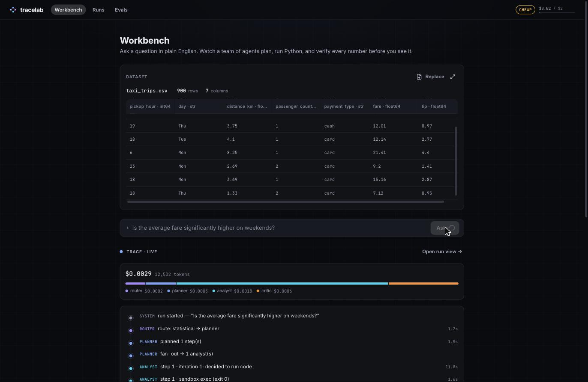
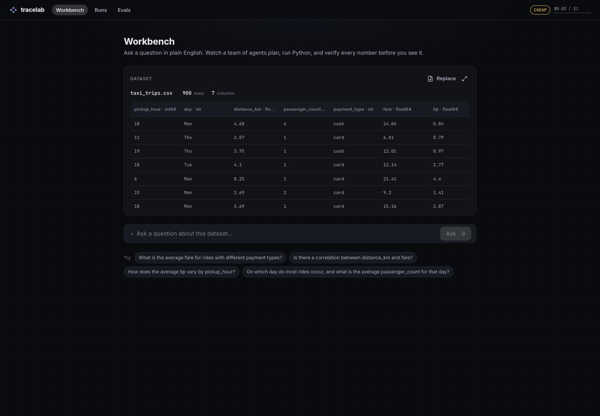
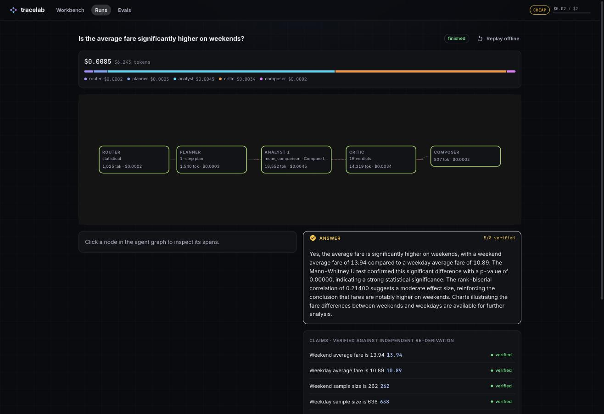
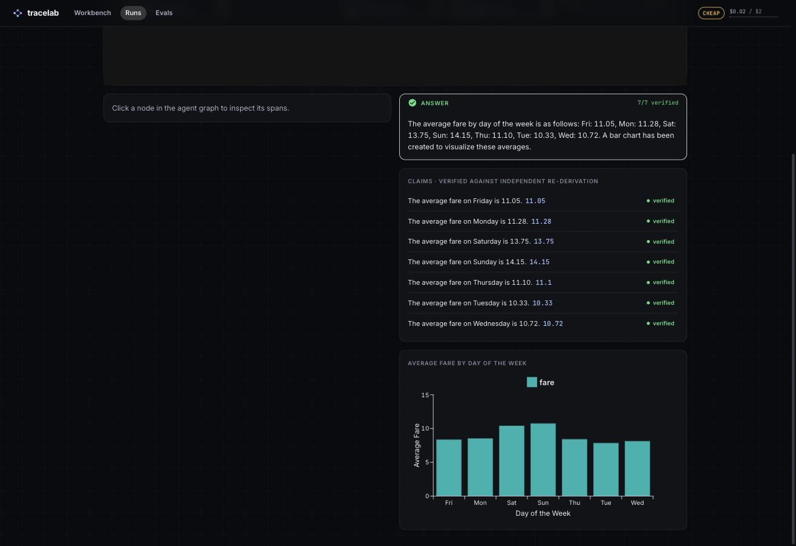
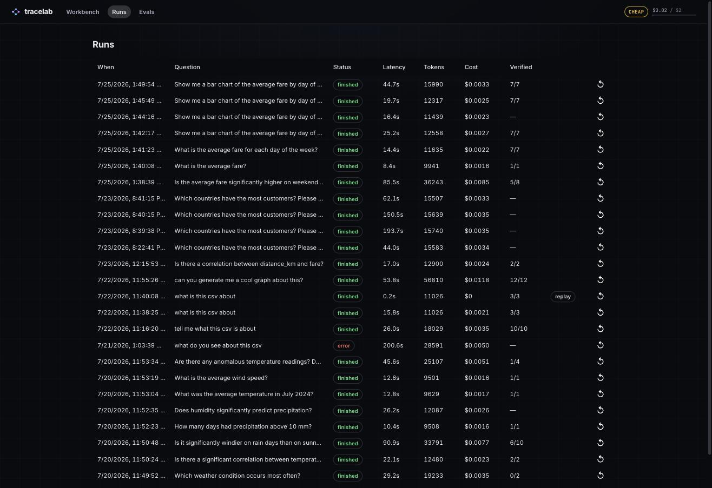

# tracelab

**An agentic data analyst you can watch think.**

Upload a CSV, ask questions in plain English. A team of LangGraph agents plans
the analysis, writes and runs Python in a sandbox, and a critic independently
re-derives every number before it renders. Every run is traced, replayable,
costed, and scored by an LLM judge.

> Most agent demos show you the answer. **tracelab shows you the reasoning, the
> verification, the cost, and the receipts.**



## See it work

**1 — Ask.** Drop a CSV, get an auto-profile and column-aware suggested questions.



**2 — Watch it think.** Router → planner → analysts → critic → composer streams live, each
agent lighting up on the trace with its cost ticking up in real time (the hero image above).

**3 — Verify.** Every numeric claim is independently re-derived by the critic and badged
`verified`; statistical claims carry a methodology chip (test, p-value, effect size). The
agent graph and per-agent cost sit right beside the answer.



**4 — Chart.** Analysts emit charts as validated specs (not raw code), so a chart is just
another piece of verified structured output — rendered natively and referenced by the answer.



**5 — Measure everything.** Every run is stored with its cost, latency, tokens, and
verified-claim ratio — and can be replayed offline, deterministically and for free.



There's no hosted demo, and that's a judgment call, not an oversight: an app that runs
LLM-written code and bills per question is a cost-and-abuse liability with near-zero hiring
upside. It runs locally, in one command, against your own OpenAI key. See
[Run locally](#run-locally).

---

## Why

**LLM output is untrusted by default.** Every number an analyst agent claims
gets independently re-derived by a critic that never sees the analyst's code
— only the question, the dataset profile, and the claim. Code execution is
sandboxed with resource limits. Nothing renders to the user without a
verification status attached to it.

**Verification-first design, not verification-as-afterthought.** The
reconciliation gate is a conditional edge in the graph, not a lint pass
bolted on later: a discrepancy triggers one bounded retry with the critic's
findings injected, and anything still unresolved ships with an explicit
`unverified` flag instead of being hidden. Honest failure is a feature to
demo, not a bug to hide.

**Measure everything, including the judge.** Per-agent token cost and
latency, a golden-dataset eval harness with two scoring tiers, an LLM judge
hand-checked against human labels (not just trusted because it returns a
number), and a quality-vs-cost-vs-latency study across model configs. The
recorded config for a run includes a content hash of every agent prompt, so
a pass-rate move is attributable to *what* changed rather than merely
noticed.

**Budgets are enforced, not advisory.** Two layers, because they fail
differently: per-agent call/tool/token caps bound one agent looping forever,
and a per-run dollar ceiling plus the run's remaining daily headroom bound
what a whole run can spend. The dollar layer is checked inside the graph
before every model call, not only at admission — a run admitted with $0.01
of headroom left cannot then fan out four analysts and spend freely.
Exhaustion is a typed failure the composer reports, and it composes that
report deterministically, so the node whose job is to tell you about the
stop is never the node that dies of it.

Anti-goals, because restraint is a signal too:

- Not a general AutoGPT. Agents do one job: analyze tabular data.
- Not a BI tool. No dashboards-as-a-product, no SQL builder — the artifact is
  the analysis and its trace.
- No vector DB, no RAG. That story lives in a different project; this one is
  the orchestration + evals story.
- Not a framework tour. LangGraph is the only agent framework, deliberately —
  the evals, tracing, and replay layers are custom on purpose.

---

## How it works

```
┌─────────────────────────── frontend (React + Vite + TS) ───────────────────────────┐
│  Workbench        Run view (agent graph)        Runs dashboard        Evals        │
│        └──────────────── SSE stream of AgentEvents ────────────────┘              │
└────────────────────────────────────────┬───────────────────────────────────────────┘
                                          │ REST + SSE
┌────────────────────────────────────────┴───────────────────────────────────────────┐
│                              backend (FastAPI, Python 3.12)                        │
│                                                                                     │
│   api/            routes: upload, runs, ask (SSE), replay, evals                   │
│   runtime/        graph.py, state.py, events.py, reconcile.py, recording.py        │
│   agents/         router, planner, analyst, critic, composer, judge (+ prompts)    │
│   sandbox/        subprocess executor: no network, CPU/mem/time rlimits            │
│   tracing/        spans, cost meter, SQLite persistence                            │
│   evals/          golden datasets, harness, scoring, judge, calibration, study     │
└────────────────────────────────────────┬───────────────────────────────────────────┘
                                          │
                               SQLite (runs, spans, evals)
                               ./data/    (uploaded + sample CSVs)
                               OpenAI API (only external dependency)
```

One paragraph per agent:

- **Router** — a single mini-model call at graph entry that classifies the
  question `simple | multi_step | statistical` and decides whether the
  planner runs at all. See [The orchestration](#the-orchestration).
- **Planner** — decomposes a question into 1–4 typed analysis steps
  (`descriptive`, `mean_comparison`, `correlation`, `regression`,
  `clustering`, `timeseries_backtest`, `anomaly_detection`), each independent
  enough to fan out in parallel.
- **Analyst** — one instance per plan step. Runs a small tool loop: write
  Python, execute it in the sandbox, read stdout back, repeat up to 3 times,
  then emit structured `Claim`s (numeric, categorical, or statistical) and
  any chart specs.
- **Critic** — reads the question, the dataset profile, and the claims — not
  the analyst's code — and independently derives its own answer for each
  claim. A deterministic reconciliation function, not the LLM, decides
  whether the two agree (see [Verification](#verification)).
- **Composer** — folds everything into the final narrative. On the simple
  route with one verified finding, composition is just that finding — no
  extra LLM call. Otherwise it synthesizes across steps and explicit
  `unverified` flags where the critic couldn't confirm something.

**The critic-independence decision:** the critic is deliberately blind to how
the analyst got its number. If it saw the code, it would be grading the
analyst's homework with the analyst's answer key open — agreement would mean
nothing. Independent derivation from the same raw inputs is the entire point
of having a critic at all.

---

## The orchestration

Built on **LangGraph** (`langgraph` + `langchain-openai`), in
`backend/app/runtime/graph.py` + `state.py`. The compiled graph, router
included:

```
                              START
                                │
                                ▼
                          ┌───────────┐
                          │  ROUTER   │  1 mini-model call, structured output:
                          │           │  simple | multi_step | statistical
                          └─────┬─────┘
              simple             │              multi_step / statistical
        ┌──────────────────────┘ └───────────────────────┐
        │                                                 ▼
        │                                          ┌────────────┐
        │                                          │  PLANNER   │  decomposes into
        │                                          │            │  1..N typed steps
        │                                          └─────┬──────┘
        │                                                │  Send() — one branch
        │                                                │  per independent step
        ▼                                                ▼
  ┌───────────────────────────────────────────────────────────────┐
  │                          ANALYST(s)                            │  parallel
  │     write python → sandbox exec → interpret, ≤3 iterations     │  branches
  └────────────────────────────────┬────────────────────────────────┘
                                    ▼
                             ┌─────────────┐
                             │   CRITIC    │  independently re-derives every
                             │  (gate)     │  claim; reconciles within tolerance
                             └──────┬──────┘
                 all verified       │       discrepancy, retries left
             ┌──────────────────────┘             │
             │                                     ▼
             │                          Send() retry of disputed
             │                          steps only, critic's findings
             │                          injected ──► ANALYST(s) ──► CRITIC (again)
             │                                     │
             │                     retries exhausted / still disputed
             │                                     │
             ▼                                     ▼
                          ┌──────────────┐
                          │   COMPOSER   │  folds into the final step on the
                          │              │  simple route (single verified
                          │              │  finding, no extra call); full
                          │              │  synthesis otherwise; explicit
                          │              │  "unverified" flags on anything
                          │              │  unresolved
                          └──────┬───────┘
                                 ▼
                                END
```

- **Typed state** — `RunState` is a Pydantic model: question, dataset
  profile, route + reason, plan, `analyst_results` (an `Annotated[...,
  operator.add]` list so parallel branches merge safely — last result per
  `step_id` wins on retry), verdicts, retry counters, the final answer.
- **Conditional edges as verification gates** — `route_from_router` sends
  straight to a single analyst on `simple`, or to the planner otherwise;
  `fan_out` turns a plan into one `Send("analyst", ...)` per step;
  `route_after_critic` is the reconciliation gate — verified claims go to
  the composer, a discrepancy triggers exactly one retry (bounded by
  `max_retries`) of only the disputed steps with the critic's reasoning
  injected into the analyst's next prompt.
- **`Send` fan-out** — both the initial multi-step dispatch and the critic
  retry use LangGraph's `Send` API, so independent plan steps (and disputed
  retries) genuinely run in parallel branches, not a `for` loop.
- **Checkpointing** — `SqliteSaver` checkpoints state at every superstep,
  keyed by `thread_id=run_id`. That buys crash recovery (a run resumes from
  its last checkpoint) and is the foundation LangGraph's own time-travel
  debugging is built on.

### What LangGraph is doing under the hood

`StateGraph.compile()` produces a **Pregel** program: node execution proceeds
in synchronous *supersteps* — every node scheduled for this superstep runs
(conceptually) in parallel, then the graph applies each node's returned
partial-state update through the state's declared *channels* before deciding
the next superstep. That's what makes the fan-out safe: `analyst_results` is
declared with `Annotated[list[AnalystResult], operator.add]`, so N parallel
analyst branches returning `{"analyst_results": [result]}` in the same
superstep get *reduced* (concatenated) into one list rather than racing to
overwrite each other — no manual locking, no explicit join step. Conditional
edges are just a function of the current state returning the name(s) of the
node(s) to schedule next, including dynamic `Send` targets computed at
runtime (the fan-out width isn't known until the planner returns). The
`SqliteSaver` checkpointer persists the full channel state after each
superstep, which is what makes "resume this run from where it crashed" and
"replay from any point" fall out of the framework instead of being hand-built
on top of it.

### The `AgentEvent` model

One event type feeds the SSE stream, the SQLite trace store, and the live
graph UI — deliberately designed first, because everything downstream hangs
off its shape (`backend/app/runtime/events.py`):

```python
class AgentEvent(BaseModel):
    run_id: str
    span_id: str            # uuid, assigned on creation
    parent_span_id: str | None
    agent: str               # "router" | "planner" | "analyst" | "critic" | "composer" | "system"
    type: EventType           # run_started | llm_call | tool_call | handoff | verdict | answer_chunk | run_finished | error
    payload: dict
    tokens_in: int
    tokens_out: int
    cost_usd: float
    started_at: float
    duration_ms: int
```

Every node emits these directly (there's no `astream_events` translation
layer — nodes call `_emit(...)` inline), which keeps span parenting exact:
each analyst branch roots its events under its own first span so the run
view can render one subtree per parallel branch. Routing decisions are
`handoff` events (`{"route": "simple", "reason": "...", "to": "analyst"}`),
so **the run view literally shows a different graph shape for a simple
question than a statistical one** — the strongest demo moment in the app.
That's the routing thesis in one line: **the orchestration scales with the
question; most questions don't need orchestration.**

---

## Verification

**Critic independence.** The critic node builds its prompt from the
question, the dataset profile, and the claims JSON only — the analyst's
Python is never in its context (`backend/app/runtime/graph.py:critic_node`).
It writes and runs its own code in the same sandbox to re-derive each value.

**The tolerance policy** lives in plain, unit-tested Python
(`backend/app/runtime/reconcile.py`), not in the LLM's judgment — the model
only supplies its independently-derived value; a deterministic function
decides whether it matches:

- **Integral values** must match exactly.
- **Floats** use a relative-epsilon comparison (`numeric_rel_tolerance`,
  default 1%), with a near-zero guard so `0.0 vs 0.00001` doesn't blow up on
  a division by a tiny denominator.
- **Categorical** claims compare case-insensitive, whitespace-stripped.
- **Statistical** claims must agree on *direction* and *significance*, not
  just on a number — and a method the critic judges inappropriate
  (`methodology_ok: false`) is a discrepancy even when the numbers agree.
  Methodology review, not just arithmetic, is the point of the critic.

**On discrepancy:** the graph retries the disputed step exactly once (a
`Send` back to the analyst with the critic's finding injected as feedback);
if it's still unresolved after that, the claim ships as `unverified` with
the critic's reason attached rather than being silently dropped or
overwritten. The Workbench renders a `ClaimBadge` — a green "verified" chip
or an amber "unverified" chip with the discrepancy in a tooltip
(`frontend/src/components/ClaimBadge.tsx`).

**The methodology gate.** Statistical claims additionally carry a
`Methodology` (test name, n, p-value, effect size + its name, assumptions
checked), rendered as a `MethodologyChip` — e.g. `Welch t-test · n=214 ·
p=0.003 · Cohen's d=0.41`, with assumptions checked in a tooltip
(`frontend/src/components/MethodologyChip.tsx`). A statistically shaky
answer gets flagged exactly like a wrong number.

---

## Evals

**Golden sets are self-verifying, not hand-typed.** 33 questions across 3
bundled datasets (taxi trips, retail sales, weather — 11 each,
`backend/app/evals/golden/*.yaml`), each with an `expected` block. Expected
*values* are computed from the actual CSVs by `derivations.py` and written
via `python -m app.evals golden --write`, not guessed by a human staring at
a spreadsheet — the golden set can be regenerated from data, not just
maintained by hand.

**Two-tier scoring** (`backend/app/evals/scoring.py`, `judge.py`):

- **Tier 1, programmatic** — for `numeric`/`categorical`/`statistical`
  questions, the harness pulls the claimed value out of the structured
  `FinalAnswer` and compares it directly (numeric tolerance via the same
  `numbers_match` the critic uses; statistical claims check direction +
  significance + whether the method used falls in an acceptable family).
  Cheap, exact, zero LLM calls.
- **Tier 2, LLM judge** — `narrative` questions, plus a 1–5 rubric across
  four dimensions (`clarity`, `uncertainty_honesty`, `chart_appropriateness`,
  `methodological_soundness`) on every answer, judged by a model pinned
  independently of the config under test (`gpt-4o`, so the study's quality
  axis measures the agents, not the judge). `real_judge()` pins that model
  explicitly rather than resolving it through `model_for("judge")`, which
  collapses to the analyst model under `CHEAP_MODE` — and the snapshot
  records the model that will *actually* run, not the one configured.

**First live baseline** (eval `3b5fec45879f`, config `gpt-4o-mini`
everywhere): **67% tier-1 pass (20/30 scorable questions)**, ~$0.11 for the
full 33-question sweep. That number comes straight out of
`python -m app.evals report` — nothing here is hand-typed.

> **The judged run from that era is retracted, not restated.** A second run
> (`af062bcbea34`) recorded `judge_avg 4.35/5` at ~$0.12, and the README used
> to quote it. Two defects made it unusable, both since fixed and both worth
> naming rather than quietly deleting:
>
> 1. **The judge was not pinned on the `run` path.** `real_judge()` took no
>    model, so it fell through `CHEAP_MODE` to `gpt-4o-mini` — the config
>    under test grading its own answers, which is precisely what pinning
>    exists to prevent. The recorded config still claimed `gpt-4o`.
> 2. **Judge spend was never counted.** Per-question cost summed graph spans
>    only, and the judge runs outside the graph so it emits no span. Every
>    `$/question` figure, including the ~$0.11/~$0.12 above, excludes the
>    tier-2 line item entirely.
>
> Both are fixed in code (the judge is pinned and its usage is now charged),
> so the next judged sweep produces a number that means what it says. Until
> that sweep runs, there is no tier-2 figure here.

**Judge calibration (say the real thing, do the real thing).** The harness
supports hand-labeling judged answers against the same rubric and reporting
judge-vs-human agreement — exact %, within-1 %, and Cohen's κ, overall and
per rubric dimension (`backend/app/evals/calibration.py`). The label
template for the 33 judged answers in `af062bcbea34` already exists
(`backend/app/evals/labels/human_labels.yaml`) but is not yet hand-labeled —
that pass is the owner's, deliberately: an agent hand-filling its own
grading key would defeat the point of calibration.

Two caveats before that labeling pass is worth doing. First, `af062bcbea34`
is the retracted run above, so calibrate against a fresh judged sweep
instead — measuring agreement with an unpinned judge measures the wrong
thing. Second, `chart_appropriateness` will report `κ = 0.000` regardless of
how well the human agrees, because `judge.md` hardcodes "score 4" when no
chart was needed and a dimension with zero variance has undefined κ; the
code currently returns `0.0` there, which is indistinguishable from
chance-level agreement.

> **Judge calibration table — placeholder.** Regenerate after labeling:
> ```bash
> cd backend
> .venv/bin/python -m app.evals label-template af062bcbea34 > app/evals/labels/human_labels.yaml
> # hand-fill the four rubric scores per question, then:
> .venv/bin/python -m app.evals calibration
> .venv/bin/python -m app.evals report   # pastes the markdown table below
> ```
> | Dimension | n | Exact % | Within-1 % | Cohen's κ |
> |---|---|---|---|---|
> | _pending owner hand-labels_ | — | — | — | — |

**The tradeoff study.** `python -m app.evals study` sweeps the full golden
set once per model config (`backend/configs/{mini,strong-planner,
strong-critic,strong}.yaml` — mini everywhere, strong planner only, strong
critic only, strong everywhere; judge always pinned to `gpt-4o`) and
`python -m app.evals report --png docs/assets/tradeoff.png` renders the
markdown table and the quality-vs-cost-vs-latency scatter.

> **Tradeoff study — placeholder.** Neither has run yet as of this doc. The
> old estimates (~$1 for mini, $10–20 for the three strong configs) were
> computed before judge spend was counted, and with the judge pinned to
> `gpt-4o` in every config it is frequently the largest single line item —
> treat them as floors, not forecasts. The strong configs stay gated on the
> owner's go-ahead (M5 build plan, Task 5). Regenerate with:
> ```bash
> cd backend
> .venv/bin/python -m app.evals study                       # all four configs
> .venv/bin/python -m app.evals report --png ../docs/assets/tradeoff.png
> ```
> | Config | Tier-1 pass | Judge avg (1–5) | $/question | s/question |
> |---|---|---|---|---|
> | _pending live study run_ | — | — | — | — |
>
> 
>
> Conclusions land here once the study has real numbers — written from what
> the chart actually says (does `strong-planner` beat `mini` on
> quality-per-dollar? does `strong` justify its cost over `strong-critic`?),
> not from priors.

**Regression tracking.** Every eval run is tagged with git SHA + a
`config_hash` over the exact per-role models, the *effective* judge model, a
content digest of every agent prompt, tolerance, and alpha — so two configs
that differ only in, say, the router model or a reworded `analyst.md` never
collide. The prompts matter most here: they are the biggest lever on answer
quality in the system, and while they were outside the hash a pass-rate move
could be observed but never attributed. The snapshot carries a schema
`version` so hashes from an older shape are not mistaken for reproducible
ones, and a sweep with no judge records `judge_model: null` rather than
naming a judge that never ran. The Evals screen plots tier-1 % and judge
average over time.
A GitHub Actions job (`.github/workflows/ci.yml`, `eval-gate`) runs the
programmatic tier on every PR and fails the build if the pass rate drops
more than a margin below `baseline.json` — it currently self-skips (exits 0)
until the owner adds an `OPENAI_API_KEY` repo secret and writes a baseline,
which is an honest state, not a broken one.

---

## Tradeoffs & limits

**Sandbox isolation.** Each execution is a fresh subprocess: no network,
`resource.setrlimit` caps on CPU/memory/file-size/process-count, a temp
workdir containing only a copy of the dataset, no proxies or API keys in its
environment. That's right-sized for a personal local tool where you trust
the machine it runs on. It is **not** what a multi-tenant product would
ship: the real next step is gVisor- or Firecracker-class isolation (a
container-per-execution sandbox with a syscall boundary), or literally
Firecracker microVMs the way Lambda/Fly do it. Subprocess + rlimits is the
honest current answer, not the final one.

**In-process orchestration vs. durable queues.** The graph runs in the same
FastAPI process that serves the request; analyst fan-out is LangGraph
`Send`, not a message queue. That's fine at one-user, one-run-at-a-time
scale, and it's what makes the whole thing runnable with `make dev` and no
infrastructure. It stops being fine the moment you need runs to survive a
process restart mid-execution at scale, or want to horizontally scale
analyst workers independently of the API — at that point analyst dispatch
moves onto a durable queue (Celery/Temporal/SQS) and the checkpointer's
"resume from last superstep" semantics become the recovery story instead of
"the process didn't die."

**Known gaps in the measurement layer.** A tool whose pitch is "measure
everything" owes you the list of things it currently measures wrong. These
came out of an audit of the docs against the code and are open, not fixed:

- **`judge_avg` averages only over runs that did not crash.** `harness.py`
  appends a judge score only when `final is not None`, so a config that
  crashes more questions scores *higher*, and nothing records how many
  answers were actually judged. This corrupts the study's quality axis,
  which is a cross-config comparison of exactly this number.
- **Tier 1 passes on any claim matching, and ignores verification status.**
  `scoring.py` returns pass on the first claim whose value matches, so an
  incidental claim can pass a question whose headline claim is wrong, and a
  claim this system's own critic marked `unverified` still counts as a pass.
- **Cohen's κ reports `0.000` for the undefined case**, and
  `chart_appropriateness` is guaranteed to hit it: `judge.md` hardcodes
  "score 4" when no chart was needed, so that dimension has zero variance
  and will print as chance-level agreement no matter how well the human
  agrees.
- **The CI eval-gate compares a bare float.** `baseline.json` stores a pass
  rate with no `config_hash`, git SHA, or question count, so a
  `--datasets taxi` run (11 questions) is gated against a 33-question
  baseline, and `--gate --write-baseline` together silently ratchet the
  floor down after a regression.
- **Neither golden-set nor sample-dataset versions are in the provenance.**
  Prompts and models are hashed now; regenerating a sample CSV or editing a
  per-question tolerance still moves the pass rate with no attributable
  signal in the recorded config.

**Known gaps in the live layer.** Same principle, different subsystem:

- **SSE events are pushed onto an `asyncio.Queue` from a worker thread.**
  `put_nowait` schedules via `call_soon`, not `call_soon_threadsafe`, so the
  loop only notices on the next keepalive — the cost meter's "real time" is
  in practice bursty and seconds late.
- **A process restart strands a run permanently.** Event history and the
  finished-run set live in process memory and nothing reconciles
  `runs.status` on startup, so the row stays `running`, a new subscriber
  blocks on the queue forever, and the dashboard polls indefinitely.
- **The run view draws critic and composer nodes as `done` on paths where
  they never ran**, keyed off the presence of a `run_finished` event rather
  than that agent's own spans.

**Anti-goals**, restated as boundaries actually held:

- Not a general AutoGPT — agents do exactly one job, analyzing tabular data.
- Not a BI tool — no dashboard builder, no SQL authoring surface.
- No vector DB, no RAG in this project.
- One agent framework (LangGraph) on purpose; the evals, tracing, and replay
  layers are custom, not because LangGraph couldn't do it, but because
  building them was the point.

**What I'd build next:** close the measurement gaps above, in that order
(they undermine every number the project reports, which makes them worth
more than any new feature); container-per-execution sandboxing; a durable
queue for analyst dispatch so a run survives a process restart; more
statistical methods behind the same methodology-chip contract (currently
mean comparison, correlation, regression, clustering, time-series backtest,
and anomaly detection); a second LLM provider behind the same config-driven
`model_for(role)` seam to prove the model-agnostic design isn't just a
one-provider illusion — which also means growing `PRICES` beyond its two
entries, since an unpriced model is now a hard stop rather than a silent
$0.00.

---

## Run locally

Requirements: Python 3.11+ (CI runs 3.12), Node 20+.

```bash
make install                          # backend venv (uv/pip -e) + frontend npm install
cp backend/.env.example backend/.env  # add your OPENAI_API_KEY
make dev                              # backend :8000 + frontend :5173, together
```

Then open http://localhost:5173, upload a CSV (or pick a bundled sample),
and ask a question.

```bash
make test    # backend pytest — fully keyless, stubbed LLMs
make lint    # backend ruff check + frontend tsc typecheck
```

`CHEAP_MODE=1` (the default in `.env.example`) forces mini models everywhere
for day-to-day dev; unset it to use the real per-role config in
`backend/app/config.py`. See `docs/architecture.md` for the full design
writeup and `docs/evals.md` for the eval methodology in depth.
