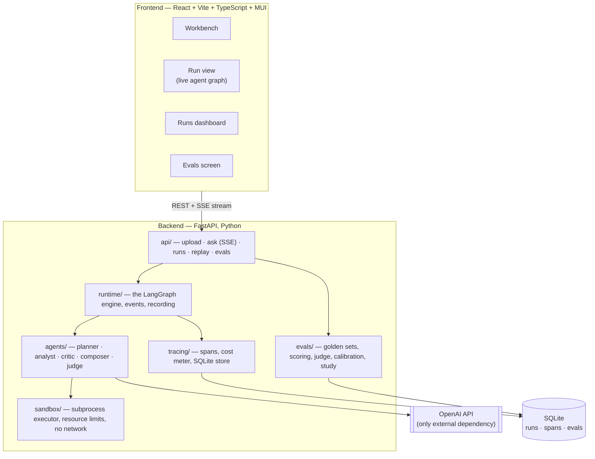
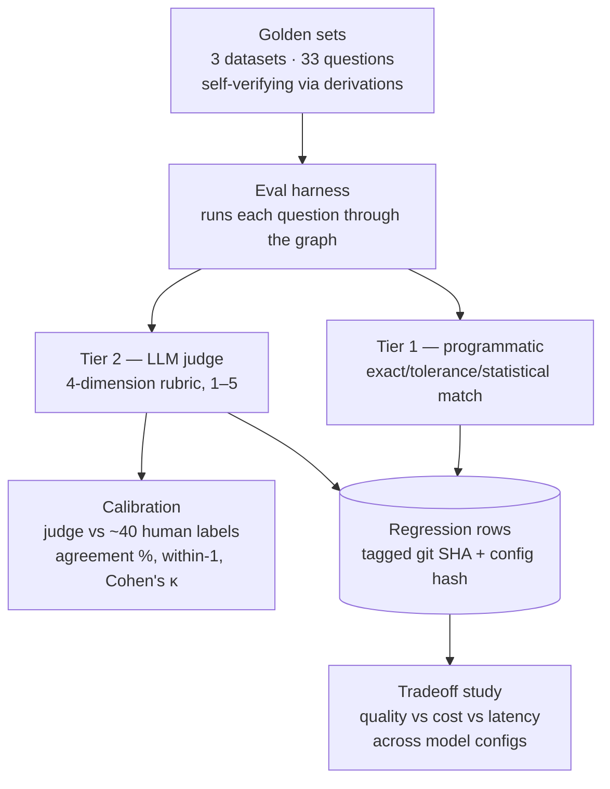

# tracelab — Project Overview

**An agentic data analyst you can watch think.**

Upload a CSV, ask a question in plain English. A team of AI agents plans the
analysis, writes and runs Python in a sandbox, and an independent critic
re-derives every number before you see it. Every run is traced, replayable,
costed, and scored by a calibrated LLM judge.

> The one-line pitch: **most agent demos show you the answer; tracelab shows you
> the reasoning, the verification, the cost, and the receipts.**

This document is the 5-minute scope tour — what the project is, what it
demonstrates, and where the engineering judgment lives. Deeper material lives in
[`architecture.md`](architecture.md) and [`evals.md`](evals.md).

---

## Why this project exists

Most "AI agent" demos are a thin wrapper over a language model: they take your
question, ask the model, and print whatever comes back. tracelab is built around
three positions that are harder to fake and are exactly what a data or ML team
worries about in production:

1. **Deep fluency with the industry-standard agent stack.** The orchestration is
   built on **LangGraph** the way companies actually use it — a typed state
   graph, conditional edges as verification gates, parallel fan-out, and durable
   checkpointing.
2. **Treat the model's output as untrusted.** Code runs in a locked-down sandbox.
   A separate critic agent independently re-derives the results and reconciles
   them before anything is shown. This is the production-judgment signal.
3. **Measure everything.** Per-agent token cost and latency, deterministic
   replay, a golden-dataset eval harness, and an LLM-as-judge that is
   *calibrated* against human labels — not just trusted.

Deliberate **anti-goals** (restraint is a senior signal): it is not a general
autonomous agent, not a BI tool, and has no vector database or RAG. It does one
job — analyze tabular data — and shows its work.

---

## What a visitor sees (the product surface)

| Screen | What it shows |
|---|---|
| **Workbench** | Drop a CSV, get an auto-profile + suggested questions, ask anything. The answer streams in with narrative, tables, and charts. Every numeric claim carries a `verified` or `unverified` badge; statistical claims add a methodology chip (test, p-value, effect size). |
| **Run view** | The live agent graph. Nodes light up as each agent runs. Click any node to see its exact prompt, response, the code it wrote, sandbox output, tokens, cost, and latency. This is the money shot. |
| **Runs dashboard** | Every past run with cost, latency, and quality, plus the quality-vs-cost tradeoff chart. |
| **Evals** | Golden-dataset scores over time, the judge-calibration table, and per-question results. |

---

## Architecture at a glance

Everything runs locally — `make dev` with your own `OPENAI_API_KEY`. There is
**no public deployment, on purpose**: an app that executes model-written code and
bills per question is a cost-and-abuse liability with near-zero hiring upside, so
the artifact is the README, the demo recording, and this repo — not a URL.

---

## The orchestration (the core)

A question flows through a small team of agents. The graph **scales with the
question**: a cheap router classifies complexity first, so simple questions skip
the planner entirely, while multi-step and statistical questions get the full
pipeline.

```mermaid
flowchart LR
    Q([question]) --> R{router<br/>simple? multi-step? statistical?}
    R -->|simple| A
    R -->|multi-step / statistical| P[planner<br/>decompose into steps]
    P -->|fan out, one per step| A[analyst&#40;s&#41;<br/>write Python → run → interpret]
    A --> C{critic<br/>re-derive & reconcile}
    C -->|all verified| M[composer<br/>final answer]
    C -->|discrepancy| A
    M --> OUT([answer + verified claims + charts])
```

- **Router** classifies the question in one cheap model call and emits its
  decision into the trace, so the run view literally draws a different graph shape
  for a simple question than for a statistical one.
- **Planner** decomposes the question into independent analysis steps.
- **Analysts** run in parallel (one per step). Each writes Python, executes it in
  the sandbox, reads the output, and iterates up to a bounded number of times.
- **Critic** never sees the analyst's code — only the question and the data. It
  independently re-derives the key numbers and reconciles them within a tolerance
  policy. Independent derivation is the whole point.
- **Composer** writes the final answer. For a single already-verified finding it
  folds that step in directly instead of making another model call.

If the critic finds a discrepancy, the run takes one bounded retry with the
critic's findings injected; if it still can't verify, the answer ships with an
explicit `unverified` flag rather than a confident-sounding hallucination.
**Honest failure is a feature to demo, not a bug to hide.**

---

## Verification — why you can trust the numbers

- **Independent re-derivation.** The critic writes its own code against the raw
  data and compares results. A claim is `verified` only if the two agree within
  tolerance.
- **A real tolerance policy.** Integers must match exactly; floats match within a
  relative epsilon (near-zero guarded); categoricals match case-insensitively;
  statistical claims must agree on direction, significance conclusion, and an
  acceptable method family. This keeps the critic from becoming noise.
- **A methodology gate.** The critic doesn't just check arithmetic — it checks
  whether the *test* was appropriate: right test for the data types, sane sample
  size, effect size reported, assumptions acknowledged. A statistically shaky
  answer is flagged like a wrong number.

---

## Evals — the differentiator

Anyone can claim "we use an LLM to judge quality." Almost nobody checks whether
the judge is any good. tracelab does.

- **Self-verifying golden set.** The expected answers aren't hand-typed — they're
  computed by plain Python from the data, so they can never silently drift. Change
  the data and a test fails until you regenerate.
- **Two-tier scoring.** Cheap exact/tolerance checks cover most questions; the LLM
  judge grades answer *quality* on clarity, honesty about uncertainty, chart
  appropriateness, and methodological soundness.
- **A calibrated judge.** You hand-label ~40 answers once; the harness reports
  judge-vs-human agreement and Cohen's kappa per dimension. That single table
  beats most "LLM-as-judge" portfolio claims, which never check the judge.
- **Regression tracking + a tradeoff study.** Every eval run is stored and tagged
  with the git SHA and a config hash, so you can chart quality over time and run
  the full set across several model configs to publish a quality-vs-cost curve.

---

## Honest tradeoffs & limits

Naming the next step instead of overclaiming is the point.

- **Sandbox isolation** is right-sized for a personal demo: a fresh subprocess
  with no network and OS resource limits. Production would use
  gVisor / Firecracker / a container per execution. Stated plainly in the README.
- **In-process orchestration.** Fine here; a high-throughput system would move to
  durable queues and workers.
- **One provider, CSV only, local-only, no auth.** All deliberate scope guards —
  the evals are the portfolio, connectors are commodity.

---

## What's the framework, and what's mine

**LangGraph / LangChain** handle orchestration mechanics (the typed graph,
supersteps, checkpointing) — using them well is itself a hiring signal. The
senior differentiation lives in the custom layers stacked on top: the
verification gates, the budget enforcement, the tracing and deterministic replay,
and the calibrated eval harness. The framework reads as a deliberate choice, not
a crutch.

---

## Tech stack

- **Backend:** Python, FastAPI, LangGraph + LangChain, SQLite, scipy/statsmodels/
  scikit-learn (the stats toolkit the analysts route to).
- **Frontend:** React + Vite + TypeScript, Material UI + MUI X (Charts, DataGrid),
  reactflow for the agent graph, TanStack Query + Zustand for state.
- **One external dependency:** the OpenAI API.
